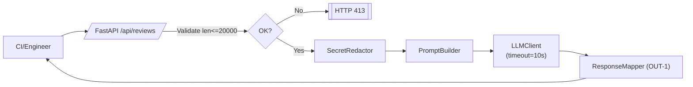

# ADR: решение для первого рабочего сценария

- Статус: proposed
- Дата: 2026-09-10
- Ответственные: команда платформы ревью, преподаватель-наставник

## Контекст

TRAINING_PR.diff добавляет метод `ReviewService.review` и POST `/api/reviews`, но нарушает правила CASE.md (SEC-1, API-1, REL-1, OUT-1). Требуется минимально доработать API-слой и сервис, чтобы:

- не отправлять секреты в LLM;
- ограничивать длину diff и возвращать 413;
- накладывать таймаут на внешний вызов;
- возвращать структурированный ответ для клиентов.

## Решение

Сделать тонкий слой валидации и адаптеров без изменения бизнес-смысла:

1. Ввести Pydantic-модель запроса `ReviewRequest(diff: str)` и ответа `ReviewResponse(summary: str, risks: list[Risk], checks: list[str])`.
2. Перед вызовом LLM пропускать diff через `SecretRedactor` (паттерны: токены, ключи, пароли) и строить prompt с явными границами.
3. Вызов LLM обернуть в клиент с таймаутом 10 сек; ошибки маппить в контролируемый ответ.
4. Маппинг ответа модели в OUT-1: `summary`, не более 3 `risks` с полями `file`, `line`, `evidence`, `risk`, и `checks`.
5. На уровне эндпоинта ограничить длину входа `<=20000`, иначе возвращать 413.

Это решение минимально вмешивается в существующую структуру (FastAPI + ReviewService + LLM) и может быть реализовано инкрементально.

## Рассмотренные альтернативы

| Альтернатива                        | Почему не выбрали сейчас                                                 |
| ----------------------------------- | ------------------------------------------------------------------------ |
| Полная асинхронизация и очереди     | Избыточно для учебного сценария; увеличивает сложность без необходимости |
| Встраивание маскировки в LLM-промпт | Ненадёжно: секрет уже утекает до промпта; требуется на входе             |
| Отказ от структурированного ответа  | Клиентам нужен контракт OUT-1 для автоматической обработки               |

## Последствия и главный риск

- Положительные последствия: безопасность ввода, предсказуемый SLA, совместимость с клиентами по контракту.
- Ограничения: ограничение длины diff до 20000 символов, не более 3 рисков; зависимость от внешнего LLM.
- Главный риск: неполная маскировка секретов из-за непокрытых паттернов.
- Как проверим риск: набор тестовых диффов с разными видами секретов; fuzzing по regex; peer review паттернов.

## Архитектурная схема

## Как использовали AI

- Для чего: сформулировать минимальное архитектурное решение и последствия.
- Тип промпта: master prompt.
- Строка в [`prompts.md`](prompts.md): P1-03.
- Что проверили и исправили сами: привязали элементы к правилам SEC-1…OUT-1 и TRAINING_PR.diff; исключили избыточные компоненты.
