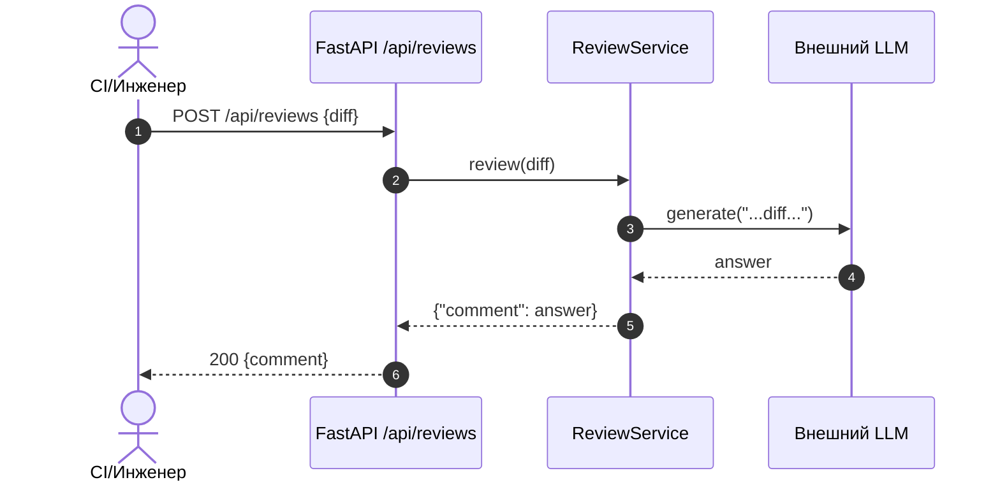
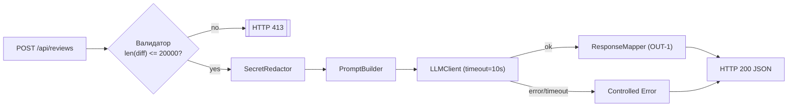

# Анализ процесса: AS IS и TO BE

## AS IS

Сценарий: CI или инженер вызывает POST `/api/reviews` с JSON `{ "diff": "..." }`. FastAPI-роут передаёт `payload["diff"]` в `ReviewService.review`, который:

- формирует строковый prompt: `"Review this pull request and find problems:\n{diff}"`;
- вызывает внешний `llm.generate(prompt)`;
- возвращает `{"comment": answer}` без структурирования.

Ограничения и потери сейчас:

- нет проверки длины diff и корректного ответа HTTP 413 (API-1 нарушен);
- нет маскировки секретов перед отправкой в LLM (SEC-1 нарушен);
- нет таймаута 10 сек и контролируемой ошибки (REL-1 нарушен);
- формат ответа не соответствует OUT-1: отсутствуют `summary`, `risks`, `checks`;
- нет явной схемы входа/выхода, возможны 500 при отсутствии поля `diff`.

## TO BE

Цель: соблюсти правила SEC-1, API-1, REL-1, OUT-1. Минимальные изменения.

Процесс:

1. Валидация входа: Pydantic-модель с полем `diff: str`; длина `<= 20000`, иначе 413.
2. Маскировка секретов: `SecretRedactor` заменяет найденные токены/пароли/ключи на `[REDACTED]`.
3. Вызов LLM через адаптер с таймаутом 10 сек; ошибки переводятся в контролируемый ответ.
4. Маппинг результата в контракт OUT-1: `summary`, `risks` (<=3, file/line/evidence/risk), `checks`.

## Разница

| Что меняется            | AS IS       | TO BE                              | Как проверим изменение                              |
| ----------------------- | ----------- | ---------------------------------- | --------------------------------------------------- |
| Входная валидация и 413 | Нет         | Длина >20000 → 413                 | Интеграционный тест POST с 21000 символов           |
| Маскировка секретов     | Нет         | Токены/пароли → [REDACTED]         | Юнит-тест `SecretRedactor`; интеграция с LLM-стабом |
| Таймаут LLM 10 сек      | Нет         | Таймаут и контролируемый ответ     | Интеграционный тест с задержкой LLM >10 сек         |
| Формат OUT-1            | `{comment}` | `summary`, `risks` (<=3), `checks` | Контрактные тесты схемы ответа                      |
| Границы роли AI         | Не заданы   | Анализ без действий                | Ревью master prompt, e2e                            |

## Как использовали AI

- Для чего: собрать минимальные изменения процесса под правила SEC-1…OUT-1 и описать их в нотации.
- Тип промпта: master prompt (контракт выполнения).
- Строка в [`prompts.md`](prompts.md): P1-03.
- Что проверили и исправили сами: соотнесли диаграммы и шаги с TRAINING_PR.diff и CASE.md; убрали лишние шаги, оставили минимально достаточные.
