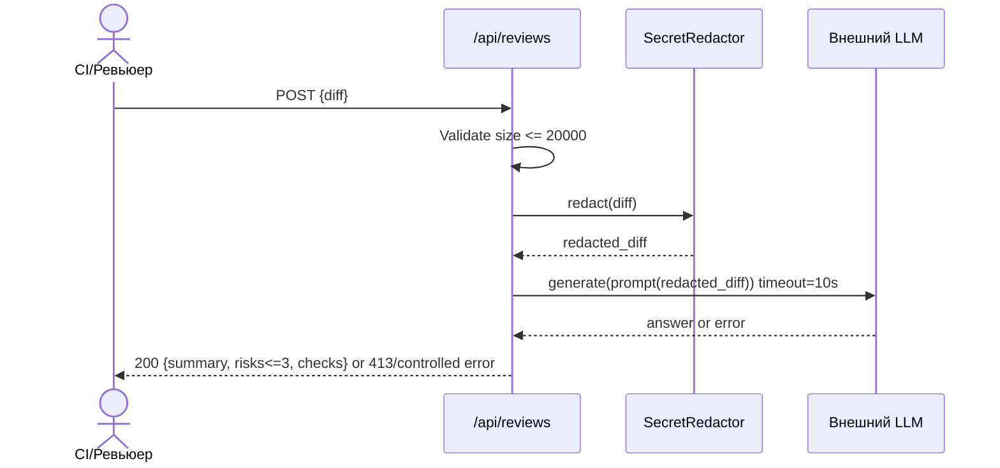

# Use cases и user stories

## Первый рабочий сценарий

Когда CI отправляет в сервис diff PR через POST `/api/reviews`, система валидирует размер, маскирует секреты, вызывает внешний LLM с таймаутом и возвращает структурированный ответ (`summary`, `risks` ≤3, `checks`). А пользователь получает краткое резюме и до трёх подтверждённых рисков с проверками.

Не входит в этот сценарий:

- approve/merge или любые действия в GitHub; изменение кода; запись содержимого diff и ответа модели в логи.

## Use case

| Поле               | Значение                                                                                                              |
| ------------------ | --------------------------------------------------------------------------------------------------------------------- |
| Актор              | Инженер ревью/CI                                                                                                      |
| Триггер            | Появился новый PR, CI формирует текстовый diff                                                                        |
| Предусловия        | Доступен сервис FastAPI, задан лимит длины и таймаут, есть доступ к LLM                                               |
| Основной результат | Возвращён JSON с `summary`, `risks` (<=3, file/line/evidence/risk), `checks`                                          |
| Ошибка или отказ   | Если `diff` > 20000 символов — HTTP 413; при ошибке LLM — контролируемый ответ с пустыми `risks` и описанием проблемы |



## User stories и acceptance criteria

```gherkin
Feature: PR review assistant returns structured and safe analysis

  Scenario: Positive — valid short diff
    Given a diff under 20000 chars without secrets
    When I POST it to /api/reviews
    Then I receive 200 with JSON containing keys summary, risks and checks
    And risks contains at most 3 items with fields file, line, evidence, risk

  Scenario: Negative — too large diff
    Given a diff longer than 20000 chars
    When I POST it to /api/reviews
    Then I receive HTTP 413

  Scenario: Boundary — diff includes secret token
    Given a diff containing "token=abcd1234"
    When the service builds a prompt for LLM
    Then the token is redacted as "[REDACTED]" before sending

  Scenario: LLM timeout
    Given the LLM takes longer than 10 seconds to respond
    When I POST a valid diff
    Then the service returns a controlled timeout error and no secrets are leaked
```

## Как использовали AI

- Для чего: структурировать сценарии использования, user stories и приёмочные критерии под SEC-1…OUT-1.
- Тип промпта: master prompt.
- Строка в [`prompts.md`](prompts.md): P1-03.
- Что проверили и исправили сами: согласовали роли/границы со Scope и TRAINING_PR.diff, убрали лишние действия вне SCOPE-1.
