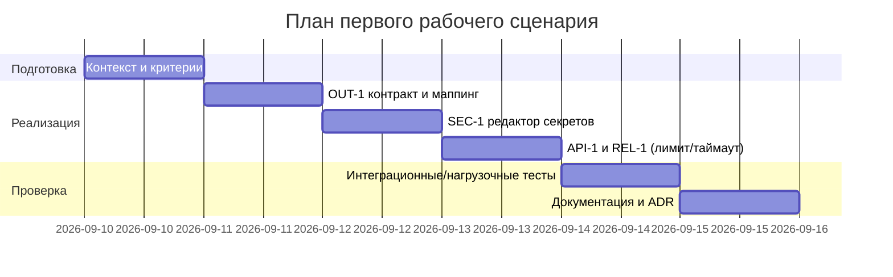

# План поставки

## Инкременты и ответственность

| Инкремент         | Наблюдаемый результат                                       | Что делает человек                    | Что делает AI или субагент               | Проверка                                    | Зависимости      |
| ----------------- | ----------------------------------------------------------- | ------------------------------------- | ---------------------------------------- | ------------------------------------------- | ---------------- |
| 1. Контракт OUT-1 | Pydantic-схемы запроса/ответа, маппинг `{comment}` -> OUT-1 | Определяет схемы, пишет маппер        | Генерирует шаблон тестов по спецификации | Контрактные unit/integration тесты проходят | TRAINING_PR.diff |
| 2. SEC-1 редактор | Утилита `SecretRedactor` с тестами                          | Формализует паттерны секретов         | Предлагает regex и граничные случаи      | Юнит-тесты на маскировку                    | 1                |
| 3. API-1/REL-1    | Лимит длины, 413; таймаут 10с и обработка ошибок LLM        | Реализует валидацию и обёртку клиента | Стабы LLM для задержек/ошибок            | Интеграционные тесты API                    | 1                |
| 4. Документация   | Обновлены context/problem/ADR/tests                         | Синхронизирует артефакты              | Проверяет согласованность                | Ревью артефактов                            | 1–3              |

## Диаграмма Ганта

## Как использовали AI

- Для чего: разложить поставку на минимальные инкременты с проверками.
- Тип промпта: master prompt.
- Строка в [`prompts.md`](prompts.md): P1-03.
- Что проверили и исправили сами: выровняли инкременты по зависимостям и правилам CASE.md; убрали несущественные задачи.
